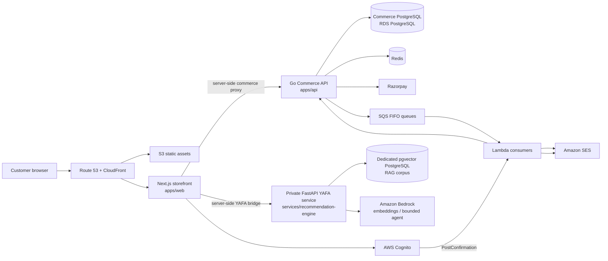
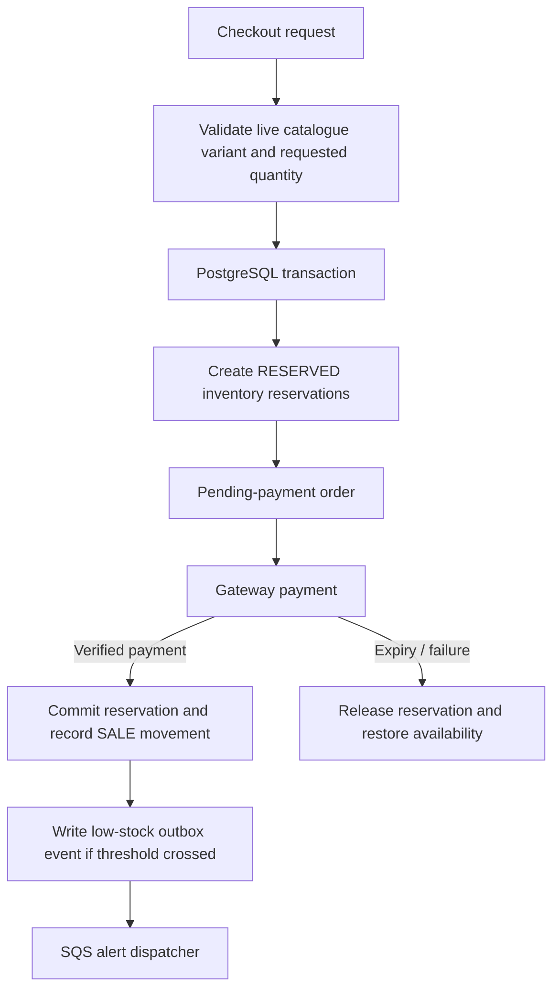
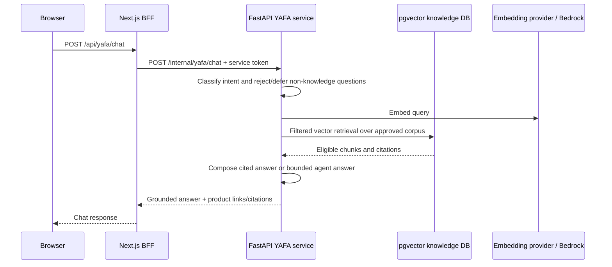
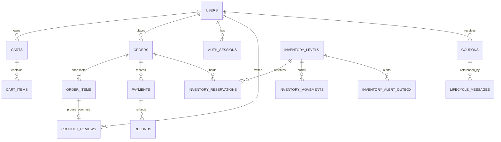
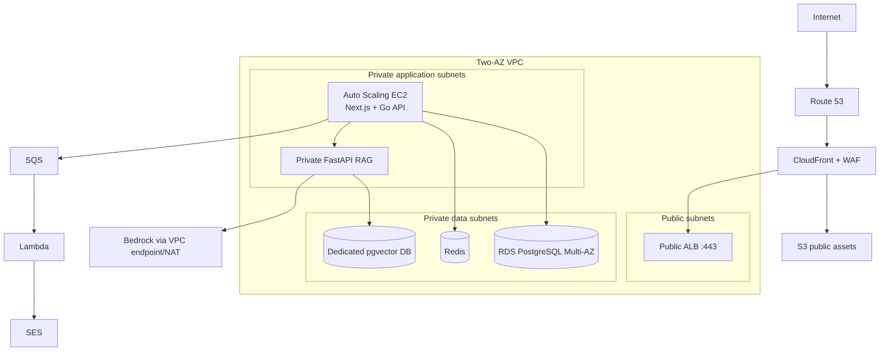

# YAFA VANAM Backend Architecture

## 1. Purpose and scope

YAFA VANAM is a beauty-commerce platform with two deliberately separate backend
domains:

1. **Commerce** is the transactional system of record. It owns catalogue
   validation, carts, inventory reservations, orders, payments, refunds,
   account-linked promotions, reviews, and lifecycle records.
2. **YAFA knowledge** is a private, grounded Retrieval-Augmented Generation
   (RAG) service. It answers only from approved product and brand knowledge;
   it cannot decide live inventory, prices, orders, refunds, payment status,
   or personalised product choices.

This boundary is the central architectural rule. PostgreSQL-backed commerce
state is authoritative for customer transactions. The RAG corpus is a separate
read model for verified content, not a business database or a decision engine.

## 2. Architecture at a glance



### Trust zones

| Zone | Components | Policy |
| --- | --- | --- |
| Public edge | Route 53, CloudFront, public ALB | HTTPS only; web assets may be cached, dynamic and customer-specific responses must not be cached. |
| Application | Next.js and Go API instances in private subnets | ALB is the only public ingress to application workloads. |
| Private services | FastAPI RAG service, Redis, worker/Lambda integrations | No direct browser access. Service-to-service calls require scoped credentials. |
| Data | Commerce PostgreSQL, dedicated pgvector PostgreSQL, DynamoDB where enabled | No public inbound route; TLS, backups, encryption, least-privilege database users. |
| External providers | Cognito, Razorpay, Bedrock, SES | Credentials and service tokens come from Secrets Manager, never the browser or repository. |

## 3. Backend components and responsibilities

### 3.1 Go Commerce API

**Location:** `apps/api`  
**Runtime:** Go HTTP service, normally port `4000`  
**Public API base:** `/api/v1`  
**Contract:** `apps/api/openapi/openapi.yaml`

The Commerce API is the authoritative business layer. It starts by loading the
normalised catalogue snapshot, applying pending PostgreSQL migrations, checking
PostgreSQL and Redis, synchronising inventory records for catalogue variants,
and then serving HTTP traffic. In production it refuses to start with missing
critical configuration such as database/Redis credentials, a sufficiently long
JWT secret, CORS allow-list, or enabled-payment secrets.

It is organised into four layers:

| Layer | Location | Responsibility |
| --- | --- | --- |
| HTTP platform | `platform/httpserver` | Routing, request parsing, response format, CORS, security headers, rate limiting, payment webhooks, panic recovery, and internal service routes. |
| Domain services | `internal/commerce`, `internal/auth` | Business invariants for catalogue, cart, order, payment, coupon, refund, inventory, review, and account flows. |
| Persistence | `internal/commerce/postgres_*.go`, `internal/database` | PostgreSQL transactions, migrations, durable idempotency, inventory locking, outbox state, and generated/query definitions. |
| Interfaces | `commerce.CommerceStore`, mailer/publisher interfaces | Makes the domain testable and allows an explicit in-memory store only for local development. |

The local in-memory commerce store is a development fallback. It is never a
valid production configuration because carts, orders, payments, and inventory
reservations would not survive a restart.

### 3.2 YAFA RAG service

**Location:** `services/recommendation-engine`  
**Runtime:** Python + FastAPI, normally container port `8000`  
**Exposure:** private; reached through the Next.js server-side YAFA bridge  
**Storage:** its own PostgreSQL database with the `pgvector` extension

The service implements grounded retrieval over an owner-approved corpus. Its
main parts are:

| Area | Location | Responsibility |
| --- | --- | --- |
| Endpoint layer | `app/api/rag_search.py`, `app/api/yafa_chat.py` | Validates the shared service token, exposes internal retrieval, health, feedback, and chat endpoints. |
| Retrieval pipeline | `app/rag` | Normalisation, chunking, embedding, filtering, source policy, retrieval, reranking controls, cache, repository, and telemetry. |
| Provider abstraction | `app/rag/providers` | Supports OpenRouter or Amazon Bedrock embeddings without coupling retrieval to one provider. |
| Chat orchestration | `app/yafa` | Intent classification, bounded conversation context, prompt construction, citations, and deterministic fallback composition. |
| Operations | `scripts`, `migrations`, `tests` | Corpus ingestion, embedding rebuilds, safety evaluation, health probes, and shadow embedding-space migration. |

The optional Bedrock agent is strictly bounded: it may call only verified RAG
search, at most twice per question. The answer is rejected when citations do
not match retrieved chunks, when the agent times out, or when the answer is not
supported. In those cases the service composes a deterministic, cited response
from retrieved source content instead.

### 3.3 Next.js backend-for-frontend (BFF)

The Next.js storefront (`apps/web`) is not merely a static client. Its route
handlers act as a narrow Backend-for-Frontend layer:

- `/api/v1/*` proxies browser commerce calls to the Go API.
- `/api/cart/*` maintains the opaque guest cart ID in an HTTP-only cookie.
- `/api/auth/*` proxies first-party session routes and performs the Cognito
  bridge.
- `/api/payments/razorpay/*` calls the server-side commerce client.
- `/api/yafa/*` sends YAFA chat requests to FastAPI with
  `X-Yafa-Service-Token`.

The BFF keeps internal base URLs and shared service tokens out of browser
JavaScript. Browser requests should target the storefront's same-origin routes,
not private services directly.

### 3.4 Asynchronous integrations

| Integration | Trigger | Delivery path | Reliability behaviour |
| --- | --- | --- | --- |
| Order confirmation | A Razorpay payment is verified by client confirmation or a signed webhook. | Commerce API → SQS → Lambda → SES | Queue publishing is best-effort for the customer response; SQS/Lambda retries email delivery. Payment status remains correct even if email fails. |
| Low-stock alert | A transaction reduces available stock below its threshold. | Transactional outbox → background dispatcher → SQS | The sale and alert-outbox write are atomic. Dispatcher retries safely and records attempts/status. |
| Welcome coupon | Cognito confirms a new customer. | Cognito PostConfirmation → Lambda → internal Commerce API → SES | Coupon issue is idempotent and database constrained to one code per eligible user. |
| Refund lifecycle | Trusted operational tooling calls a protected internal endpoint; Razorpay confirms the gateway result. | Internal Commerce API → Razorpay → signed webhook | Refund rows have idempotency keys and unique provider references. |

## 4. Core request and event flows

### 4.1 Catalogue and cart

```mermaid
sequenceDiagram
    participant U as Browser
    participant W as Next.js BFF
    participant A as Go Commerce API
    participant D as Commerce PostgreSQL

    U->>W: Read product / update cart
    W->>A: Same-origin proxy request
    A->>A: Validate JSON, catalogue IDs, quantity and availability
    A->>D: Read or write cart and inventory state
    D-->>A: Transactional result
    A-->>W: Server-calculated cart / product response
    W-->>U: Response; opaque guest cart ID stays HTTP-only
```

Catalogue products are loaded from the normalised `data/processed/Product.json`
snapshot at API startup. Product and variant identifiers in the active
catalogue are string IDs, so cart and order line records preserve those IDs as
text and snapshot customer-visible product data at purchase time. The API,
rather than the browser, validates variants and calculates prices and totals.

For signed-in shoppers, optional authentication lets the API associate and
claim an existing guest cart. Anonymous cart access remains limited to the
opaque cart identifier; it does not expose an account's cart to other visitors.

### 4.2 Cognito sign-in and first-party commerce session

```mermaid
sequenceDiagram
    participant U as Browser
    participant W as Next.js BFF
    participant C as AWS Cognito
    participant A as Go Commerce API
    participant D as Commerce PostgreSQL + Redis

    U->>W: Sign up / sign in
    W->>C: Cognito user-pool action
    C-->>W: Verified ID token
    W->>A: POST /auth/cognito/exchange + ID token
    A->>A: Verify issuer, audience, signature, expiry, token use, email verification
    A->>D: Upsert local user; create hashed session records
    A-->>W: First-party access and refresh cookies
    W-->>U: Secure cookie response
```

The storefront authenticates with Cognito, then exchanges a verified Cognito
ID token for the Commerce API's first-party session. The Go API validates the
token against the pool's JWKS, including issuer, client audience, RS256
algorithm, expiry, `token_use`, subject, email, and verified-email claim. The
Cognito client secret stays in the web tier and is never required by the Go
verifier.

Commerce cookies are HTTP-only, `Secure` in production, `SameSite=Strict`,
and short-lived for access (15 minutes). Refresh sessions are rotated and are
stored as hashes. Mutating cookie-authenticated routes require a CSRF token.
Optional Google OAuth and native credentials remain implementation-supported
auth paths where configured; Cognito is the primary storefront identity flow.

### 4.3 Checkout and payment confirmation

```mermaid
sequenceDiagram
    participant U as Browser
    participant W as Next.js BFF
    participant A as Go Commerce API
    participant D as Commerce PostgreSQL
    participant R as Razorpay
    participant Q as SQS
    participant L as Lambda + SES

    U->>W: Start checkout with Idempotency-Key
    W->>A: Create Razorpay checkout order
    A->>D: Transactionally create pending order and inventory reservations
    A->>R: Create gateway order using server-calculated amount
    R-->>A: razorpay_order_id
    A->>D: Persist provider order reference
    A-->>W: Public Razorpay key + order reference
    W-->>U: Launch payment widget
    U->>W: Payment completion payload
    W->>A: Verify signature
    A->>A: HMAC validation
    A->>D: Mark payment/order paid; commit reservation
    A->>Q: Publish order confirmation
    Q->>L: Deliver email job
    L->>L: Send via SES
```

The API serialises Razorpay order creation and uses the caller's
`Idempotency-Key`. A retry returns the existing business order and avoids
creating a second gateway order. Payment verification validates the Razorpay
HMAC before mutating persisted payment state. A signed Razorpay webhook is an
independent confirmation path and may safely repeat a processed event.

Only the Go API holds the Razorpay key secret and webhook secret. The browser
receives the public gateway key and a provider order reference, never a
server-side secret. Order confirmation is asynchronous, so a mail problem does
not transform a paid order into a failed payment.

### 4.4 Inventory consistency



`inventory_levels` carries on-hand and reserved quantities; database checks
prevent negative availability and over-reservation. `inventory_reservations`
is linked to the order and moves through `RESERVED`, `COMMITTED`, `RELEASED`,
or `EXPIRED`. The `release_expired_inventory_reservations()` database function
must run at least once per minute in production to release abandoned payment
holds.

Inventory movements form an audit trail. The low-stock transactional outbox
ensures that an alert is not lost between a successful sale and an unavailable
queue. It is safe to retry with `SKIP LOCKED`-style worker coordination and a
unique `(variant_id, inventory_version)` constraint.

### 4.5 YAFA grounded knowledge chat



The RAG service provides these internal endpoints:

| Endpoint | Purpose |
| --- | --- |
| `POST /internal/rag/search` | Return eligible, verified product/brand source chunks. |
| `POST /internal/rag/feedback` | Emit privacy-safe helpfulness or review signals to logs. |
| `GET /internal/rag/health` | Report database and embedding-space status without secrets or DSNs. |
| `POST /internal/yafa/chat` | Answer a knowledge question with citations and deterministic fallback. |

All are protected by `X-Yafa-Service-Token`, validated with constant-time
comparison. The token must be at least 32 characters. Multi-tenant retrieval
also validates the trusted-gateway tenant identity and HMAC signature. The RAG
API exposes no embedding vectors, database credentials, raw internal errors,
image-analysis interface, voice interface, shade matcher, medical advice, or
personalised recommendation endpoint.

## 5. Data architecture and ownership

### 5.1 Commerce PostgreSQL

The Commerce API owns schema migrations in `apps/api/db/migrations`. The
currently active operational tables and relationships are summarised below.



| Data group | Primary records | Ownership and rule |
| --- | --- | --- |
| Identity and session | `users`, credentials/identity mappings, `auth_sessions`, `auth_tokens` | Commerce owns its local user record and opaque first-party session state. Do not store raw passwords or raw long-lived tokens. |
| Commerce | `carts`, `cart_items`, `orders`, `order_items`, `payments` | Orders preserve item identity, display data, price, SKU, and other purchase-time facts so history is not modified by future catalogue edits. |
| Inventory | `inventory_levels`, `inventory_reservations`, `inventory_movements`, `inventory_alert_outbox` | PostgreSQL transaction and constraints protect sellable stock and make outbound alerts durable. |
| Customer programs | promotions, `coupons`, promotion redemptions, `lifecycle_messages` | First-order promotions and service-recovery vouchers are account-bound and constrained for one-time use. |
| Trust and service | `refunds`, product-review tables, consent records | Refunds are idempotent. Reviews require a verified purchase and moderation before public display. |

The old generic core product tables should not be confused with the runtime
catalogue snapshot. The active cart/order persistence layer deliberately stores
catalogue product and variant IDs as text because the authoritative storefront
catalogue is loaded from `Product.json`. This avoids false foreign-key claims
against unseeded legacy UUID product records while retaining durable commerce
history.

### 5.2 RAG pgvector database

The RAG service uses a **separate** PostgreSQL instance/database configured by
`VECTOR_DATABASE_URL`. It stores approved documents, chunks, embeddings,
aliases, corpus revisions, and retrieval metadata. It must never share the
commerce schema or be used for payment, inventory, orders, or customer PII.

At startup the service validates that all four values agree:

1. configured embedding dimension;
2. provider output dimension;
3. pgvector column dimension; and
4. recorded embedding provider/model/dimension metadata.

If an embedding space changes, rebuild it with the documented shadow database
workflow instead of mixing vector spaces. A corpus revision also changes the
cache namespace so responses cannot outlive their source snapshot.

### 5.3 Cache and ephemeral state

Redis supports authentication/session infrastructure and distributed rate
limiting in the Commerce API. It is not the source of truth for checkout,
payment, coupon redemption, or inventory. Loss of Redis should result in a
degraded health state rather than silent use of stale business data; PostgreSQL
remains authoritative.

## 6. API surface and access model

### Commerce API (`/api/v1`)

| Resource | Representative routes | Access |
| --- | --- | --- |
| Health | `GET /health`, `GET /ready` | Public operational probes; reports dependency status. |
| Catalogue | `GET /categories`, `GET /products`, `GET /products/{slug}` | Public read-only. |
| Reviews | `GET /products/{productID}/reviews`, `POST /products/{productID}/reviews` | Read public; creation needs an authenticated eligible purchaser. |
| Cart | `POST /carts`, `GET /carts/{cartID}`, add/update/remove item routes | Guest or authenticated; signed-in requests can claim their guest cart. |
| Orders | `POST /orders`, `GET /orders`, `GET /orders/{orderNumber}` | Creation/listing require a session when auth is configured; guest lookup requires a separate order access token. |
| Razorpay | order creation, payment verification, signed webhook | Checkout/verify need session when auth is configured; webhook validates Razorpay signature. |
| First-party auth | `/auth/csrf`, `/auth/me`, register/login/refresh/logout/reset, Cognito exchange, optional Google OAuth | Cookie-based session endpoints; mutation is CSRF protected. |
| Internal operations | coupon, refund, and lifecycle-message routes under `/api/internal/*` | Machine-to-machine only; fail closed unless `YAFA_INTERNAL_SERVICE_TOKEN` is configured. |

The definitive request/response schema is OpenAPI. Any API-contract change
must update `apps/api/openapi/openapi.yaml`, regenerate
`packages/frontend-types/generated/api-types.ts`, and be committed with the
Go implementation and tests.

## 7. Security architecture

| Concern | Current control |
| --- | --- |
| Network exposure | Browser calls Next.js; RAG is private. Datastores, queues, and workers have no public inbound path. |
| Authentication | Cognito ID tokens are verified server side, then exchanged for first-party opaque cookie sessions. |
| Authorisation | Required and optional middleware attach only validated local users to request context. Account/order/review routes enforce ownership or purchase eligibility. |
| CSRF | Double-submit token required for cookie-authenticated mutations. |
| Service calls | Internal RAG and operations endpoints require shared, 32+ character service tokens; tenant RAG requests additionally verify a gateway HMAC. |
| Payment integrity | Razorpay order amounts originate on the server; completion and webhook payloads require HMAC signature validation. |
| Idempotency | Order/payment and refund records use idempotency keys and unique references. Asynchronous consumers are designed to tolerate duplicates. |
| Input handling | Strict JSON decoding, bounded body reads for webhooks, domain validation, structured safe errors, and server-side catalogue validation. |
| Perimeter hardening | HTTPS, CORS allow-list, security headers, request timeouts, rate limiting, WAF/CloudFront controls, and no cache for sensitive dynamic routes. |
| Secrets | Database secrets, JWT secret, payment credentials, Cognito client secret, service tokens, and provider keys live in Secrets Manager. No AWS access keys are stored in services. |
| Observability privacy | JSON logs and Sentry use safe error information; transactional email code avoids logging addresses, orders, payment references, or coupon codes. |

## 8. Reliability, observability, and operations

### Health and startup gates

- The Commerce API provides `/health` and `/ready`; it reports PostgreSQL and
  Redis state and returns `503` when configured dependencies are unhealthy.
- The RAG service provides public process health at `/health` and token-guarded
  detailed RAG health at `/internal/rag/health`.
- Startup validates catalogue availability, database connectivity, migrations,
  Redis, and inventory synchronisation. Production start-up fails rather than
  quietly running with missing dependencies.
- RAG start-up validates pgvector availability and embedding-space identity;
  incompatible vector stores do not serve queries.

### Failure strategy

| Failure | Expected behaviour |
| --- | --- |
| PostgreSQL or Redis unavailable | Commerce health becomes degraded/unavailable. Production must not fall back to in-memory state. |
| Payment provider error | The client receives a safe gateway error; idempotency allows a retry without duplicate order creation. |
| Webhook replay | Reprocessing remains safe because payment/refund references are unique and transitions are persisted. |
| SQS/SES outage | Payment state remains successful; queued delivery retries separately. Low-stock outbox retries later. |
| Embedding or agent failure | YAFA returns a safe temporary error or a deterministic cited fallback; it must not invent answers. |
| Cache loss | Cache is rebuilt from its authoritative database/corpus; it does not invalidate transaction history. |

### Monitoring

Use JSON application logs and Sentry for API/RAG errors, plus CloudWatch logs,
metrics, alarms, and deployment rollback signals in AWS. At minimum alert on:

- availability and p95 latency of the web, Commerce API, and RAG endpoints;
- RDS connection pressure, replication/backup failures, and storage growth;
- Redis failures and rate-limit error rate;
- Razorpay verification/webhook failures and pending-payment age;
- SQS age, dead-letter queue depth, Lambda errors, and SES delivery failures;
- inventory reservation expiry backlog and low-stock outbox retry backlog;
- Bedrock throttles, RAG cache misses, retrieval failures, and citation/fallback
  rate; and
- Cognito trigger failures and welcome-coupon delivery failures.

## 9. Deployment architecture

### Local development

`docker-compose.yml` starts the backend/data stack:

| Container | Local port | Role |
| --- | --- | --- |
| `postgres` | `5432` | Commerce PostgreSQL. |
| `rag-postgres` | `5433` | Dedicated pgvector database. |
| `redis` | internal | Cache/rate-limit dependency. |
| `api` | `4000` | Go Commerce API. |
| `yafa-rag` | loopback `8001` → container `8000` | Private-ish local RAG bridge; still token protected. |

The Next.js storefront runs separately, normally on port `3000`. The local
split mirrors production: commerce and RAG do not share a database, and the
browser is not configured with the RAG service token.

### AWS target



Production uses two public and four private subnets across at least two
availability zones. Route 53, CloudFront, ACM, the WAF, a public ALB, and an
Auto Scaling group provide the public path. Application containers remain
useful build artifacts but run on private EC2 instances in the current target
architecture. RDS is Multi-AZ with backups, encryption, TLS, deletion
protection, and enhanced monitoring. Use VPC endpoints or controlled NAT
egress for ECR, S3, Secrets Manager, CloudWatch, SQS, DynamoDB, Bedrock, and
SES.

CloudFront may cache immutable static assets only. It must bypass caching for
API, authentication, cart, checkout, order, and personalised responses.

## 10. Configuration and operational invariants

### Required configuration groups

| Group | Examples | Rule |
| --- | --- | --- |
| Commerce runtime | `DATABASE_URL`, `REDIS_URL`, `JWT_SECRET`, `CORS_ALLOWED_ORIGINS`, `APP_URL` | Required for a production Commerce API. JWT secret is at least 32 characters. |
| Payments | `RAZORPAY_CHECKOUT_ENABLED`, key ID, key secret, webhook secret | All required before enabling Razorpay checkout. |
| Identity | Cognito region, user pool ID, client ID; optional Google/SMTP settings | Missing Cognito settings disable its bridge rather than partially accepting tokens. |
| Internal services | `YAFA_INTERNAL_SERVICE_TOKEN`, Commerce/RAG internal URLs | Kept server-side; missing token disables protected internal routes. |
| RAG | `VECTOR_DATABASE_URL`, embedding provider/model/dimension, cache namespace, tenant signing secret | Vector database must be distinct from Commerce PostgreSQL; embedding identity must match stored vectors. |
| AWS | region, SQS URLs, Sentry DSN, release version | Instance roles are preferred over static AWS credentials. |

### Non-negotiable invariants

1. Never use the RAG database for commerce state, and never use the commerce
   database as a vector store.
2. Never take a price, stock decision, payment state, refund state, or
   promotion entitlement from the browser or RAG response.
3. Never expose `YAFA_INTERNAL_SERVICE_TOKEN`, payment secrets, database URLs,
   or server-side Cognito secrets to client-side code.
4. Never mark an order paid based only on browser input; validate the Razorpay
   signature and accept signed webhooks as an independent reconciliation path.
5. Never replace durable production stores with the in-memory development
   implementation.
6. Never combine embeddings generated in different provider/model/dimension
   spaces; rebuild a complete isolated space instead.
7. Preserve idempotency for checkout, coupons, refunds, webhooks, queues, and
   Lambda consumers.

## 11. Code map and change guidance

| Change type | Primary location | Required companion work |
| --- | --- | --- |
| Commerce endpoint | `apps/api/platform/httpserver` and `internal/commerce` | Update OpenAPI, regenerate frontend types, add Go tests, preserve auth/CSRF/error conventions. |
| Commerce schema | `apps/api/db/migrations` | Add forward-only migration, repository/query changes, and PostgreSQL test coverage. |
| Catalogue/data import | `data/scripts` and `data/processed` | Normalise/validate source data; ensure API start-up and inventory sync still agree on variant IDs. |
| Payment or refund | `platform/httpserver/razorpay.go`, `refunds.go`, store implementation | Preserve signature verification, idempotency, audit state, and asynchronous notification semantics. |
| Identity | `internal/auth`, web Cognito bridge | Preserve token verification, cookie flags, session rotation, CSRF, rate limiting, and ownership checks. |
| YAFA capability | `services/recommendation-engine/app` | Update schemas, sources, safety tests, citations, corpus revision/cache strategy, and RAG migrations if needed. |
| RAG corpus | RAG ingestion scripts/migrations | Re-ingest approved data, evaluate answers, validate citations, and use a clean embedding-space migration when model/dimension changes. |
| AWS integration | `infra/aws`, Lambda source, deployment docs | Apply least privilege, private networking, monitoring, retry/DLQ handling, and secret management. |

## 12. Verification checklist

Before releasing a backend change, verify the following in the deployed-like
environment:

- `go test ./...` passes for the Commerce API; PostgreSQL-backed tests run when
  `TEST_DATABASE_URL` is available.
- RAG tests pass, including retrieval, source-policy, cache, provider,
  ingestion, citation, and agent safety coverage.
- OpenAPI and generated frontend types match the Commerce API behaviour.
- `/health`, `/ready`, and token-guarded RAG health report expected dependency
  status.
- A checkout retry with the same idempotency key produces one business order
  and one Razorpay order; a repeated payment webhook is harmless.
- An expired reservation returns stock exactly once; low-stock alert events
  remain dispatchable after a transient queue failure.
- Browser requests cannot reach the private RAG service or read service tokens.
- YAFA refuses/delegates live-commerce questions and returns cited answers only
  from approved knowledge.
- Deployment secrets, CORS origins, TLS, IAM policies, network routes,
  CloudFront cache behaviours, and Sentry/CloudWatch alarms are checked for
  the target environment.

## References

- [Commerce API contract](../api.md)
- [Database schema notes](../database-schema.md)
- [RAG service guide](../rag/README.md)
- [AWS production architecture](../deployment/aws-production-architecture.md)
- [RAG production controls](../deployment/rag-production-controls.md)
- [Project structure](../PROJECT_STRUCTURE.md)
